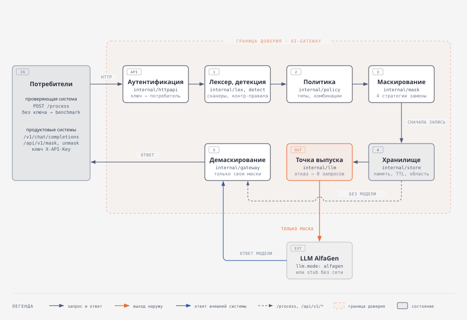
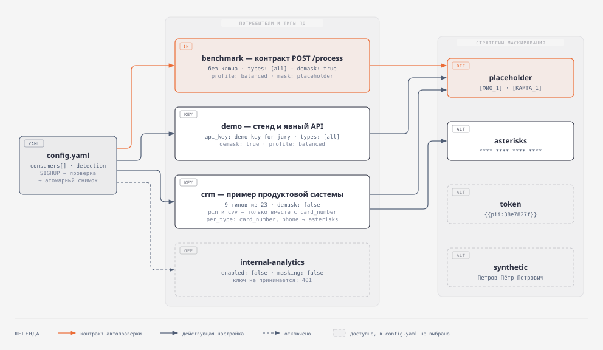

# ai-gateway — модуль безопасности персональных данных

Сервис-прокси между системой-потребителем и языковой моделью: находит в тексте
персональные данные 17 обязательных и 7 дополнительных типов, маскирует их до
отправки в модель и восстанавливает в ответе. Определение детерминированное —
грамматики, справочники, контрольные суммы и контекст, без нейросетей внутри
защиты. Каждая система-потребитель получает свою политику: какие типы скрывать,
чем заменять, можно ли восстанавливать.

Трек «Модуль безопасности персональных данных», хакатон AlfaGen.

**Публичный адрес:** `http://94.228.167.253:8080` — контракт автопроверки
`POST http://94.228.167.253:8080/process`, демонстрационный стенд
`http://94.228.167.253:8080/`. Все команды ниже работают и против локального
запуска, и против публичного адреса — достаточно заменить `localhost:8080`
([T-04](tasks/T-04-deploy.md)).

**Мониторинг по реальным метрикам:** `http://94.228.167.253:3000` — Grafana
только на просмотр. Графики строит Prometheus, который сам раз в 5 секунд
опрашивает `GET /metrics` сервиса; сервис для этой страницы ничего не готовит.

**Презентация решения для жюри:** `http://94.228.167.253:8080/presentation` —
слайды с инструкцией проверки, архитектурой, настройками, замерами,
ограничениями и планом развития. Её же можно открыть файлом
[web/presentation.html](web/presentation.html), он встроен в бинарник.
Листать колесом, свайпом или стрелками; `O` — обзор слайдов, `#N` в адресе —
прямая ссылка на слайд.

Схема архитектуры: [docs/diagrams/architecture.svg](docs/diagrams/architecture.svg),
схема настроек: [docs/diagrams/settings.svg](docs/diagrams/settings.svg).



## Быстрый старт

```bash
cp .env.example .env    # вписать ALFAGEN_API_KEY; для /process ключ не нужен
docker compose up -d --build
curl -sS localhost:8080/healthz
```

Проверка контракта автопроверки — прямой шаг:

```bash
curl -sS -X POST localhost:8080/process -H 'Content-Type: application/json' \
  -d '{"payload":"Клиент Иванов Иван Иванович, паспорт серия 4509 номер 123456, ИНН 500123456750, карта 4111 1111 1111 1111, cvv 123, тел. +7 916 123-45-67, почта ivan.petrov@example.com, родился 12 мая 1990 года","payload_id":"readme-1"}'
```

```json
{"result":"Клиент [ФИО_1], паспорт серия [ПАСПОРТ_1] номер [ПАСПОРТ_2], ИНН [ИНН_1], карта [КАРТА_1], cvv [CVV_1], тел. [ТЕЛЕФОН_1], почта [EMAIL_1], родился [ДАТА_РОЖДЕНИЯ_1] года"}
```

Обратный шаг — та же маска с тем же `payload_id`; сервис возвращает исходную
строку побайтово:

```bash
curl -sS -X POST localhost:8080/process -H 'Content-Type: application/json' \
  -d '{"payload":"Клиент [ФИО_1], паспорт серия [ПАСПОРТ_1] номер [ПАСПОРТ_2], ИНН [ИНН_1], карта [КАРТА_1], cvv [CVV_1], тел. [ТЕЛЕФОН_1], почта [EMAIL_1], родился [ДАТА_РОЖДЕНИЯ_1] года","payload_id":"readme-1"}'
```

Служебные слова («серия», «номер», «тел.», «года») остаются снаружи масок
намеренно: их маскирование штрафуется как избыточное.

Без Docker:

```bash
go build -o ai-gateway ./cmd/ai-gateway && ./ai-gateway -config config.yaml
```

Либо через `Makefile`, если порт 8080 занят или сервис нужен в фоне:

```bash
make run-bg PORT=8099    # собрать и поднять в фоне; журнал — reports/ai-gateway-8099.log
make stop PORT=8099      # остановить
make help                # все цели
```

Все примеры текста в этом README и в `scripts/demo.sh` синтетические: номер
карты — тестовый, ИНН и паспорт сгенерированы, адрес почты на `example.com`.

## Инструкция по настройке

Все настройки живут в `config.yaml`, а ключи доступа — в переменных окружения, имена которых указаны в конфигурации.
Чтобы подключить новую систему-потребителя, добавьте в список `consumers` запись с её идентификатором, именем переменной с ключом, перечнем типов ПД и стратегией маскирования.
Чтобы изменить поведение существующей системы, отредактируйте её запись: `enabled` включает и отключает доступ, `types` задаёт маскируемые типы, `mask.default` и `mask.per_type` задают способ замены, `demask` разрешает обратное преобразование, а `combinations` включает маскирование только при совпадении нескольких типов.
Изменения применяются без перезапуска сигналом HUP: `docker compose kill -s HUP ai-gateway` или `kill -HUP <pid>`.
Невалидный файл отклоняется, и сервис продолжает работать на прежних настройках.

## Инструкция для жюри

Всё ниже проверяется без чтения кода. Адрес по умолчанию — `localhost:8080`;
для публичного стенда подставьте его адрес.

**1. Демонстрационный стенд.** Откройте `http://localhost:8080/`, в поле
«Ключ доступа» в шапке введите `demo-key-for-jury`, вставьте свой текст и
запустите прогон. Стенд разбит на вкладки; у каждой своя прямая ссылка
(`/#dashboard`, `/#logs` и т. д.):

| Вкладка | Что на ней |
|---|---|
| **Проверка жюри** (`#jury`) | ввод текста и прогон; найденные данные с типом, уровнем уверенности и сработавшим правилом; **что фактически ушло в модель** — исходный текст рядом с отправленным телом запроса и автоматическая сверка на утечку; ответ модели как есть и после восстановления; время сервиса отдельно от ожидания модели |
| **Дашборд** (`#dashboard`) | работает без ключа: Latency, p95, RPS, TPS, графики за последние 5 минут, ПД по типам, исходы запросов, распределение времени ответа, запросы по эндпоинтам, хранилище соответствий и рантайм Go; фильтр эндпоинта — выберите `/process`, чтобы видеть цифры, которые меряют организаторы |
| **История и трассировка** (`#history`) | последние запросы владельца ключа и диаграмма этапов выбранного запроса |
| **Журнал** (`#logs`) | поток журнала с фильтрами, поиском и переходом к трассировке по идентификатору запроса |
| **Конфигурация** (`#config`) | только просмотр: версия, потребители, каталог типов ПД с отметкой обязательных по ТЗ, сканеры детекции |

Переключатель «Система-потребитель» прогоняет тот же текст под политикой
другой системы: у `crm` номер карты и телефон скрываются звёздочками, а
восстановление запрещено; `demo-token` и `demo-synthetic` показывают две
другие стратегии — токен `{{pii:…}}` и правдоподобную синтетику. Право
восстановления берётся от ключа, а не от выбранной политики.

**Независимая проверка цифр — Grafana** (`http://localhost:3000`, на публичном
стенде — порт 3000 того же адреса). Дашборд стенда рисует сервис сам, поэтому
рядом поднята стандартная связка: Prometheus опрашивает открытый `/metrics`
по внутренней сети Docker и хранит ряды сутки, Grafana показывает по ним
доступность (`up`), запросы в секунду по маршрутам, время сервиса p50/p95/p99
на `/process`, исходы запросов (`overloaded` и `rate_limited` — это `429`),
скрытые ПД по типам, TPS, хранилище соответствий, память и сборки мусора.
Вход, правка и регистрация в Grafana выключены, дашборд и источник данных
задаются файлами из `deploy/grafana/`. Нагрузку для графиков можно дать
прямо отсюда: `make load HOST=http://94.228.167.253:8080`.

**2. Маскирование и восстановление по контракту.** Команды из «Быстрого
старта» выше: прямой шаг возвращает маску, обратный — исходную строку. Тот же
сценарий с побайтовой сверкой и ловушками одной командой:

```bash
./scripts/demo.sh http://localhost:8080
```

Скрипт печатает исходный текст, маску, восстановленный текст и отметку
«совпадает с оригиналом побайтово» для четырёх случаев: полный набор
реквизитов; верхний регистр, падежи и иной порядок даты; ловушки; однофамилец
публичной персоны.

**3. Ловушки и вариации написания.** Эти тексты можно отправить на
`/process` или на стенд:

| Текст | Результат |
|---|---|
| `Поэт Александр Пушкин жил на улице Мойки. Отделение банка: г. Москва, ул. Тверская, 7.` | не меняется: публичная персона и адрес организации — не ПД |
| `Клиент Александр Пушкин, телефон +7 916 000-11-22` | `Клиент [ФИО_1], телефон [ТЕЛЕФОН_1]` — однофамилец-клиент защищён |
| `ПЕТРОВА анна сергеевна, дата рождения 12.31.1985` | `[ФИО_1], дата рождения [ДАТА_РОЖДЕНИЯ_1]` — регистр и порядок `мм.дд.гггг` |
| `родилась двенадцатого марта тысяча девятьсот восемьдесят седьмого года` | `родилась [ДАТА_РОЖДЕНИЯ_1] года` — дата словами целиком |
| `паспорт серия 45 09 № 123456, ВУ серия 4098 номер 849020` | `паспорт серия [ПАСПОРТ_1] № [ПАСПОРТ_2], ВУ серия [ВОДИТЕЛЬСКОЕ_УДОСТОВЕРЕНИЕ_1] номер [ВОДИТЕЛЬСКОЕ_УДОСТОВЕРЕНИЕ_2]` |

**4. Разграничение доступа.** `/process` работает без ключа, продуктовые
эндпоинты — только по ключу:

```bash
# без ключа — 401
curl -sS -o /dev/null -w '%{http_code}\n' -X POST localhost:8080/api/v1/mask \
  -H 'Content-Type: application/json' -d '{"text":"Иванов Иван"}'
# crm не имеет права demask — 403
curl -sS -o /dev/null -w '%{http_code}\n' -X POST localhost:8080/api/v1/unmask \
  -H 'X-API-Key: crm-key-for-jury' -H 'Content-Type: application/json' \
  -d '{"masked":"x","id":"any"}'
```

Потребитель `internal-analytics` отключён (`enabled: false`) и в
`GET /readyz` виден как `internal-analytics:disabled`.

**5. Журнал.** JSON на `stdout`, одна запись на запрос:

```bash
docker compose logs -f ai-gateway           # в контейнере
grep -v '^gc ' reports/ai-gateway.log       # после make run-bg (PORT≠8080: ai-gateway-<порт>.log)
```

```json
{"time":"2026-09-23T01:10:45.475056+03:00","level":"INFO","msg":"запрос обработан","request_id":"r2","endpoint":"process","payload_id":"readme-1","consumer":"benchmark","op":"mask","detected_types":["birth_date","card_number","cvv","email","full_name","inn","passport_number","phone"],"masked_types":["birth_date","card_number","cvv","email","full_name","inn","passport_number","phone"],"masked_count":9,"degraded":false,"bytes_in":265,"duration_ms":0}
```

Для прокси к модели запись дополнительно содержит `restored_count`,
`response_masked_count`, `llm_ms` — время модели отдельно от `duration_ms`.
Длительности этапов (приём, детекция, политика, маскирование, запись
соответствия, ожидание модели, восстановление, ответ) показывает трассировка
на стенде: `GET /api/v1/ui/trace?id=<request_id>` с ключом.

**6. Метрики.** `curl -sS localhost:8080/metrics | grep '^aigw_'` — формат
Prometheus. Latency — гистограмма `aigw_request_duration_seconds` по эндпоинту
и операции, без ожидания модели; время модели — `aigw_llm_duration_seconds`.
RPS — скорость роста `aigw_requests_total` по эндпоинту, операции и исходу.
TPS — `aigw_tokens_in_total` / `aigw_tokens_out_total` (токен = 4 байта, рядом
`aigw_bytes_in_total` / `aigw_bytes_out_total`). По типам ПД —
`aigw_pii_detected_total`, `aigw_pii_masked_total`. Хранилище —
`aigw_store_entries`, `aigw_store_bytes`, `aigw_store_evicted_total`,
`aigw_store_expired_total`. Рантайм — `aigw_go_*`. По потребителям —
`aigw_consumer_requests_total{consumer,endpoint,outcome}`: `consumer` — `id` из
конфигурации, для запросов без принятого ключа — `anonymous`. Исходы: `ok`,
`bad_request`, `overloaded`, `fail_closed`, `degraded`, `upstream_error`,
`client_gone`, `unauthorized` (401), `forbidden` (403), `rate_limited` (429 по
`model_rate`). Каждый отказ 401/403 пишется в журнал записью «доступ
отклонён» с причиной (`no_key`, `key_not_accepted`, `demask_not_allowed`,
`policy_not_available`) — без ключа и его частей.

**Чего нет ни в журнале, ни в метриках, ни в телах ошибок:** исходного текста,
значений ПД, содержимого соответствий и ключей доступа. Метки метрик
перечислимы: `payload_id`, `request_id` и текст запроса в метку попасть не могут
по построению. Проверено тестом `internal/obs/leak_test.go`: поиск каждого
размеченного значения в журнале, экспозиции `/metrics` и телах ответов.

## Что распознаётся

Семнадцать обязательных типов ТЗ и семь дополнительных. Ключ из первой
колонки пишется в `types` потребителя; `[all]` — все типы.

| Ключ | Тип | Плейсхолдер |
|---|---|---|
| `full_name` | ФИО | `[ФИО_1]` |
| `birth_date` | дата рождения | `[ДАТА_РОЖДЕНИЯ_1]` |
| `birth_place` | место рождения | `[МЕСТО_РОЖДЕНИЯ_1]` |
| `citizenship` | гражданство | `[ГРАЖДАНСТВО_1]` |
| `passport_number` | серия и номер паспорта | `[ПАСПОРТ_1]` |
| `passport_authority` | орган, выдавший паспорт | `[ОРГАН_ВЫДАЧИ_1]` |
| `passport_dept_code` | код подразделения | `[КОД_ПОДРАЗДЕЛЕНИЯ_1]` |
| `passport_issue_date` | дата выдачи паспорта | `[ДАТА_ВЫДАЧИ_1]` |
| `driver_license` | водительское удостоверение | `[ВОДИТЕЛЬСКОЕ_УДОСТОВЕРЕНИЕ_1]` |
| `address` | адрес и его компоненты: страна, индекс, город, улица, дом, квартира | `[АДРЕС_1]` |
| `email` | email | `[EMAIL_1]` |
| `phone` | номер телефона | `[ТЕЛЕФОН_1]` |
| `inn` | ИНН | `[ИНН_1]` |
| `card_number` | номер платёжной карты | `[КАРТА_1]` |
| `cvv` | CVV-код | `[CVV_1]` |
| `pin` | ПИН-код карты | `[ПИН_1]` |
| `card_holder` | имя держателя карты | `[ДЕРЖАТЕЛЬ_КАРТЫ_1]` |
| `snils` | СНИЛС — дополнительный | `[СНИЛС_1]` |
| `foreign_passport` | загранпаспорт — дополнительный | `[ЗАГРАНПАСПОРТ_1]` |
| `oms_policy` | полис ОМС — дополнительный | `[ПОЛИС_ОМС_1]` |
| `vehicle_reg` | госномер транспортного средства — дополнительный | `[ГОСНОМЕР_1]` |
| `vin` | VIN — дополнительный | `[VIN_1]` |
| `ogrn` | ОГРН — дополнительный | `[ОГРН_1]` |
| `bank_account` | номер банковского счёта — дополнительный | `[СЧЁТ_1]` |

Учитываются вариации написания: регистр (включая ФИО строчными; границы — в
разделе «Ограничения»), разделители, порядок компонентов
даты `дд.мм.гггг`, `мм.дд.гггг`, `гггг.мм.дд`, `гггг.дд.мм`, дата словами
целиком, конструкции «серия XXXX номер XXXXXX» и «серия XX XX № XXXXXX» для
паспорта и водительского удостоверения, падежные формы имён. У карты, ИНН,
СНИЛС, ОГРН и VIN проверяется контрольная сумма; номер карты без Луна рядом со
словом «карта» тоже маскируется. Одинаковые значения получают один номер
плейсхолдера, разные — разные.

**Голое значение.** Если весь payload — одно значение без окружающего текста
(«4618 507329», «27.03.1988», «Корнеева», «ГУ МВД России по Московской
области», «314»), оно маскируется целиком по форме строки, даже без маркера
типа: организаторы подтвердили, что в датасете есть и отдельные слова, и что
полная маска такого payload избыточной не считается (A2.1, A4.4 в
[07-clarifications.md](docs/context/07-clarifications.md)). Шаг срабатывает
только на коротком входе без структуры предложения; обычные короткие фразы
(«Добрый день», «Москва — столица России») не меняются. Тип у неразличимых
по форме двойников выбирается ближайший: голая дата — дата рождения, десять
цифр подряд — паспорт.

**Номер банковского счёта** (`bank_account`) — двадцать цифр слитно или
группами. После слова «счёт», «р/с», «л/с», «расчётный счёт», «account» номер
маскируется всегда; без маркера — только счёт клиента (балансовые счета
405–408, 423, 426) и только рядом с другими ПД того же предложения.
Корреспондентский счёт банка («к/с 30101…») — реквизит банка, а не клиента,
и не маскируется. Контрольный ключ не проверяется: он считается по БИК,
которого рядом может не быть. Тип входит в `types: [all]`.

### Как принимается решение

Десять цифр подряд — это и паспорт, и телефон, и номер договора, поэтому
каждому кандидату назначается уровень уверенности по набору сработавших
условий, а не вероятность:

| Уровень | Условие | Что происходит |
|---|---|---|
| `certain` | форма плюс контрольная сумма или самодостаточная грамматика (email, госномер) | маскируется всегда |
| `strong` | форма плюс явный маркер типа рядом | маскируется всегда |
| `weak` | совпала только форма | под `balanced` — если в том же предложении есть достоверное значение другого типа |
| `denied` | сработало контр-правило | не маскируется |

Контр-правила отличают ПД от похожих сведений: ролевые слова публичных персон
(«поэт», «писатель»), топонимы от фамилий («ул. Пушкина»), адреса и контакты
организаций («отделение банка», горячая линия), номера договоров. Правило
асимметрично в сторону защиты: маркер клиента рядом снимает контр-правило, и
однофамилец поэта будет защищён.

## Настройка

### Структура `config.yaml`

| Раздел | Поле | Назначение |
|---|---|---|
| `server` | `addr` | адрес прослушивания |
| | `max_body_bytes` | предел размера тела запроса; больше — `413` |
| | `max_concurrent` | предел одновременной обработки; сверх него — `429` с `Retry-After` |
| | `read_timeout`, `write_timeout`, `idle_timeout` | таймауты HTTP-сервера; `write_timeout` должен превышать `llm.timeout` |
| | `request_timeout` | бюджет локальной обработки запроса: детекция, политика, маскирование, запись соответствия; при исчерпании — `429` с `Retry-After`. Ожидание модели в него не входит |
| | `shutdown_timeout` | время на завершение принятых запросов при остановке |
| `store` | `ttl` | срок жизни соответствия «маска → оригинал» |
| | `max_entries`, `max_bytes` | лимиты хранилища; при исчерпании вытесняются старейшие записи |
| | `sweep_interval` | период удаления истёкших записей |
| `llm` | `mode` | `alfagen` — реальный вызов модели, `stub` — демонстрационный ответ без сети |
| | `base_url`, `model`, `timeout` | адрес, идентификатор модели и предел ожидания ответа |
| | `api_key_env` | имя переменной окружения с ключом модели; сам ключ в файле не хранится |
| `detection` | `profile` | профиль по умолчанию: `balanced`, `strict` или `paranoid` |
| | `max_spans` | предел числа замен в одном запросе |
| `logging` | `level`, `format` | уровень (`debug`, `info`, `warn`, `error`) и формат (`json`, `text`) журнала |
| `consumers` | см. ниже | список систем-потребителей |

Поля потребителя:

| Поле | Назначение |
|---|---|
| `id` | идентификатор; попадает в журнал и в метку `consumer` метрики `aigw_consumer_requests_total` |
| `enabled` | допуск к продуктовым эндпоинтам; `false` — ключ не принимается (`401`) |
| `api_key_env` | имя переменной окружения с ключом — основной способ |
| `api_key` | ключ прямо в файле — только для демонстрационных потребителей; переменная окружения его перекрывает |
| `types` | маскируемые типы: список ключей из таблицы выше или `[all]` |
| `demask` | право на обратное преобразование |
| `masking` | административное отключение маскирования; при отказе защиты оно само не выключается никогда |
| `profile` | профиль отнесения; перекрывает `detection.profile` |
| `max_spans` | собственный предел числа замен |
| `model_rate` | лимит обращений к модели по ключу: `{rps: 1, burst: 5}` — в среднем `rps` запросов в секунду и до `burst` подряд; только `/v1/chat/completions` и `/api/v1/analyze`, сверх лимита — `429` с `Retry-After`; не задан — лимита нет. Корзина своя у каждого адреса клиента, общий расход по ключу ограничен восьмикратным лимитом — посторонний с тем же опубликованным ключом не выбирает чужую квоту |
| `mask.default` | стратегия по умолчанию: `placeholder`, `asterisks`, `token`, `synthetic` |
| `mask.per_type` | стратегия для отдельного типа |
| `combinations` | правила вида «маскировать `mask` только вместе с `only_with`» |

Потребитель `benchmark` применяется к запросам без ключа, то есть к контракту
автопроверки `POST /process`. Его соответствия изолированы от остальных
потребителей: одинаковый `payload_id` у разных потребителей — разные записи.

### Как добавить потребителя

1. Добавить запись в `consumers`:

   ```yaml
     - id: support-bot
       enabled: true
       api_key_env: SUPPORT_BOT_API_KEY
       types: [full_name, phone, email, card_number, cvv, pin]
       demask: true
       masking: true
       profile: balanced
       mask:
         default: placeholder
   ```

2. Задать ключ строкой `SUPPORT_BOT_API_KEY=<ключ>` в `.env`. Файл
   читается при старте процесса, поэтому новая переменная требует одного
   перезапуска: `docker compose restart ai-gateway`.
3. Дальнейшие правки записи — типы, стратегия, права — применяются без
   перезапуска: `docker compose kill -s HUP ai-gateway`. Результат виден в
   журнале и в `GET /readyz`: там появится `support-bot:enabled`.

### Как поменять набор типов и стратегию

Набор типов — поле `types`. Стратегия — `mask.default` для всех типов
потребителя и `mask.per_type` для отдельных. Пример из `config.yaml`,
потребитель `crm`:

```yaml
    types: [full_name, birth_date, phone, email, address, card_number, cvv, pin, inn]
    demask: false
    mask:
      default: placeholder
      per_type:
        card_number: asterisks        # «**** **** **** ****»
        phone: asterisks
    combinations:
      - mask: [pin]                   # ПИН маскируется только вместе
        only_with: [card_number]      # с найденным номером карты
      - mask: [cvv]
        only_with: [card_number]
```

Под этой политикой `Клиент просит сбросить пин 4821.` остаётся как есть, а
`Карта 4111 1111 1111 1111, пин 4821.` становится
`Карта **** **** **** ****, пин [ПИН_1].`. Паспорт в набор `crm` не входит и
не маскируется.

### Стратегии маскирования

| Стратегия | Пример | Когда применять |
|---|---|---|
| `placeholder` | `Иванов Иван Иванович` → `[ФИО_1]` | по умолчанию: полное сокрытие, тип виден модели, смысл запроса сохраняется |
| `asterisks` | `4111 1111 1111 1111` → `**** **** **** ****` | когда важна узнаваемость структуры значения |
| `token` | `Иванов Иван Иванович` → `{{pii:38e7827f}}` (HMAC-SHA256 с ключом `AIGW_TOKEN_KEY`; без ключа — случайный на процесс) | когда модели не следует знать даже тип данных |
| `synthetic` | `Иванов Иван Иванович` → `Петров Пётр Петрович`; `Шевчук Оксана Васильевна` → `Петрова Анна Петровна` | когда важна максимальная естественность текста для модели |

Маска звёздочками, за которой стоят разные значения, в изменённом тексте не
восстанавливается: вернулось бы не то значение. Неизменённая маска
восстанавливается при любой стратегии.

Синтетика повторяет форму исходного ФИО — число слов, роли, порядок и род. В
ответе модели восстанавливаются и её производные формы: часть ФИО («Анна
Петровна»), падежи, написание через «е», последние четыре цифры и слитная
запись карты и телефона. Синтетику, которую восстановить нельзя, и ПД,
которые модель написала сама, клиент получает плейсхолдером `[ФИО_N]`, а не
правдоподобным вымыслом. У фамилий нестандартного склонения косвенный падеж
восстанавливается именительным.

### Профили отнесения

| Профиль | Поведение |
|---|---|
| `balanced` | достоверные и сильные кандидаты; слабый кандидат поднимается до сильного, если в том же предложении есть достоверное значение другого типа. Значение по умолчанию и профиль `benchmark` |
| `strict` | только достоверные и сильные; слабые не маскируются и внутри кластера. Меньше лишних масок ценой сокрытия |
| `paranoid` | всё, что совпало по форме |

Цена `strict` измерена на одной сборке и одном корпусе (`RESULT`, коммит
`ac6c869`, [QUALITY.md §9.2](docs/spec/QUALITY.md)): сокрытие 0,9369 против
0,9729 у `balanced`, избыточность 0,0024 против 0,0040, ложных срабатываний на
ловушках ноль у обоих. `paranoid` на текущем корпусе не перемерялся.

### Как добавить новый тип персональных данных

1. Добавить константу и запись в реестр `internal/pii/types.go`: машинный
   ключ, название, основа плейсхолдера.
2. Создать сканер `internal/detect/scan_<имя>.go`; он регистрирует себя сам
   вызовом `detect.Register` в `init` — общий список редактировать не нужно.
3. При необходимости положить справочник в
   `internal/detect/dict/data/<имя>.txt`; он встраивается в бинарник
   автоматически.
4. Включить ключ типа в `types` нужных потребителей (или оставить `[all]`).

Транспорт, маскирование и ядро обработки при этом не меняются. Пример такого
расширения — шесть дополнительных документов ([T-17](tasks/T-17-extra-documents.md))
и номер банковского счёта ([T-64](tasks/T-64-digits-round4.md)).

### Как расширить справочник

Добавить строку в соответствующий файл `internal/detect/dict/data/*.txt`:
одна запись на строку, `#` — комментарий, необязательный второй столбец через
табуляцию — метка записи. Так пополняются, например, роли публичных персон
(`counter_roles.txt`), публичные фамилии (`counter_public.txt`), домены
организаций (`email_orgs.txt`). Справочники встраиваются при сборке, поэтому
нужна пересборка образа.

## Эндпоинты

| Метод | Путь | Назначение | Доступ |
|---|---|---|---|
| POST | `/process` | контракт автопроверки: `{payload, payload_id}` → `{result}` | без ключа, потребитель `benchmark` |
| POST | `/v1/chat/completions` | прокси к модели, OpenAI-совместимый, `stream: false` | ключ |
| POST | `/api/v1/mask` | маскирование без обращения к модели: `{text, id?}` → `{masked, id, types, counts}` | ключ |
| POST | `/api/v1/unmask` | восстановление: `{masked, id}` → `{text}` | ключ и право `demask` |
| POST | `/api/v1/analyze` | разбор текста по шагам для стенда | ключ |
| GET | `/api/v1/ui/history`, `/api/v1/ui/trace`, `/api/v1/ui/journal` | история запросов, трассировка этапов, поток журнала — записи владельца ключа и обезличенные записи контракта `/process` (помечены «контракт /process, без ключа»: только типы, счётчики и длительности) | ключ |
| GET | `/api/v1/ui/consumers` | список потребителей, режим модели и реестр типов ПД (`pii_types`) для стенда, без ключей и политик | без ключа |
| GET | `/` | демонстрационный стенд | без ключа |
| GET | `/presentation` | презентация решения для жюри | без ключа |
| GET | `/healthz` | живость процесса и версия | без ключа |
| GET | `/readyz` | готовность, действующие потребители и сканеры | без ключа |
| GET | `/metrics` | метрики в формате Prometheus | без ключа |

Ключ передаётся заголовком `X-API-Key: <ключ>` или `Authorization: Bearer <ключ>`.

### `POST /process`

Направление определяется состоянием, а не счётчиком вызовов: новый
`payload_id` — маскирование; payload, равный выданной маске, — восстановление;
повтор исходного текста — та же маска. Коды: `200`; `400` — некорректный JSON
или нет `payload_id`, либо `payload_id` длиннее 1024 байт; `405` с
`Allow: POST` — любой метод, кроме `POST`; `413` — тело больше `server.max_body_bytes`; `429` с
`Retry-After` — перегрузка, исчерпан `request_timeout` или переполнено
хранилище. Если штатная обработка всё-таки отказала, `/process` не отвечает
ошибкой: текст скрывается целиком маской `[ЗАЩИЩЕНО]`, соответствие
сохраняется, и обратный шаг работает.

### `POST /v1/chat/completions`

```bash
curl -sS -X POST localhost:8080/v1/chat/completions \
  -H 'X-API-Key: demo-key-for-jury' -H 'Content-Type: application/json' \
  -d '{"messages":[{"role":"user","content":"Составь приветствие клиенту Иванову Ивану Ивановичу, телефон +7 916 123-45-67."}]}'
```

В модель уходит `Составь приветствие клиенту [ФИО_1], телефон [ТЕЛЕФОН_1].`;
в ответе модели плейсхолдеры этого запроса восстанавливаются, а сам ответ
проходит детекцию заново. Если защита не завершена — `500` и ноль запросов в
модель (fail-closed); модель недоступна — `502`.

### `POST /api/v1/mask` и `POST /api/v1/unmask`

Маскирование без модели и восстановление отдельным вызовом позже;
применяется политика потребителя, которому принадлежит ключ.

```bash
curl -sS -X POST localhost:8080/api/v1/mask \
  -H 'X-API-Key: demo-key-for-jury' -H 'Content-Type: application/json' \
  -d '{"text":"Клиент Иванов Иван Иванович, телефон +7 916 123-45-67, карта 4111 1111 1111 1111."}'
```

```json
{"masked":"Клиент [ФИО_1], телефон [ТЕЛЕФОН_1], карта [КАРТА_1].","id":"UHTM5PTGBMCJAESCPDURTAC5PI","types":["card_number","full_name","phone"],"counts":{"card_number":1,"full_name":1,"phone":1}}
```

В `unmask` передаётся `id` из ответа `mask` — у вас он будет свой:

```bash
curl -sS -X POST localhost:8080/api/v1/unmask \
  -H 'X-API-Key: demo-key-for-jury' -H 'Content-Type: application/json' \
  -d '{"masked":"Здравствуйте, [ФИО_1]! Карта [КАРТА_1] заблокирована, [ФИО_2] в копии.","id":"<id из ответа mask>"}'
```

```json
{"text":"Здравствуйте, Иванов Иван Иванович! Карта 4111 1111 1111 1111 заблокирована, [ФИО_2] в копии."}
```

`id` необязателен: без него сервис выдаёт свой — так и стоит делать на общем стенде, иначе чужой запрос с тем же `id` займёт его первым. Допустимы латинские буквы,
цифры и `- _ . :`, до 64 байт. Неизменённая маска возвращается исходной
строкой побайтово; в изменённом тексте восстанавливаются только плейсхолдеры,
выданные для этого `id`, неизвестные остаются как есть. Повтор `mask` с тем же
`id` и тем же текстом возвращает ту же маску.

| Код | Когда |
|---|---|
| `401` | нет ключа, ключ неизвестен или потребитель отключён — ответ одинаков |
| `403` | `unmask` у потребителя без права `demask` (например, `crm`) |
| `404` | `unmask`: соответствия нет — неизвестный `id`, чужой `id` или истёк срок; ответы неразличимы |
| `409` | `mask`: `id` уже связан с другим текстом; `unmask`: текст изменён, а политика с момента маскирования поменялась |
| `413` / `400` | тело больше `server.max_body_bytes` / некорректный запрос |
| `429` | не уложились в `server.request_timeout` или хранилище переполнено; есть `Retry-After` |
| `500` | защита не завершена — маска не выдаётся, соответствие не записывается |

## Архитектура



Запрос проходит аутентификацию, лексер и детекцию, политику потребителя,
маскирование и запись соответствия — всё внутри границы доверия. Наружу, в
модель, текст выходит в одном месте — `internal/llm`, и только если все шаги
завершились; любой отказ даёт ноль исходящих запросов. Контракт `/process` и
явный API модель не вызывают. Подробно — [ARCHITECTURE.md](docs/spec/ARCHITECTURE.md),
исходники схем — [architecture.html](docs/diagrams/architecture.html) и
[settings.html](docs/diagrams/settings.html).

## Качество

`RESULT`, 23.09.2026: сборка `d40fafe`,
корпус `corpusgen -seed 20260922 -count 1200 -long=true` (sha256 `ab3a42e3…`,
1204 записи, 4978 размеченных значений, 144 ловушки), потребитель
`benchmark`, профиль `balanced`, `qualitycheck 1.0`, ноль ошибок прогона.
Команда: `make run-bg PORT=8122 && make quality PORT=8122 SEED=20260922`.

| Показатель | Значение |
|---|---|
| Доля сокрытия (строгая: значение не осталось в ответе ни целиком, ни частью) | **0,9988** (верхняя граница 0,9992); на втором корпусе seed 20260925 — 0,9982 |
| Precision / F1 | **1,0000** / **0,9994** |
| Ловушек сработало | **0 из 144** |
| Ошибок восстановления | **0 из 1204**, побайтово |
| Голое значение — payload из одного значения (`corpusgen -bare`) | **204 из 204** |
| Избыточность — доля замаскированного вне размеченных значений | 0,0223 (повторы найденных значений и поля анкеты, которые корпус не размечает) |
| Записей без ПД изменено / замаскировано целиком | 0 из 96 / 0 |
| Тексты жюри раундов 4–5 (725 фраз бизнес- и технического жюри с разметкой «скрыть» и «оставить») | утечек **3 из 960** значений, лишних масок **0 из 192** |

Все типы, кроме двух, — 1,0000, включая ФИО (613 из 613), место рождения и
орган выдачи; орган выдачи 0,9753 (4 частичные утечки в длинных записях) и
CVV 0,9917. Методика и разбор — [QUALITY.md](docs/spec/QUALITY.md) §14. Формула официальной метрики не
опубликована, поэтому совместимость с официальным расчётом не утверждается.

## Производительность

`RESULT` из [PERFORMANCE.md](docs/spec/PERFORMANCE.md) §11–§14: Apple M1 Max,
клиент и сервис на одной машине через loopback, закрытый контур, контракт
`/process` (модель не вызывается).

| Режим | Результат |
|---|---|
| профиль проверки: 200 соединений, 5 минут | 38 435 запр/с; у клиента среднее 5,197 мс, p99 7,216 мс; сервис 0,025 мс на маскирование; ошибок и расхождений восстановления — 0 (сборка `7f930d6`); на текущей `fbea639` — 37 603 запр/с, среднее 5,311 мс, p99 8,7 мс, сервис 0,035 мс, 0 ошибок и 0 расхождений на 5,45 млн пар (§14) |
| текст на 100 000 токенов, один запрос | 40 мс (медиана), из них детекция 22,7 мс — на `7f930d6` и `faf8d3f`; на `fbea639` — 35,7 мс, детекция 25,9 мс (§14) |
| тексты по 100 000 токенов, 32 соединения, 40 с | маскирование: среднее 112,5 мс, p99 234,0 мс, максимум 369,9 мс (`7f930d6`); на `fbea639` — среднее 144,7 мс, p99 279,6 мс, 0 ошибок (§14) |
| поиск предела (сборка `c2f69c2`) | p99 ≤ 1 с до 3200 соединений |
| **публичный адрес** `94.228.167.253:8080`, клиент на другой машине через интернет, 200 соединений, 5 минут, сборка `4d5b1a7` (§13); повтор на `869122e` — 6 050 запр/с, p99 58,5 мс, сервис 0,066 мс, 0 ошибок (§14.5) | **6 529 запр/с**; у клиента среднее 30,6 мс (из них сеть ≥ 21 мс), p99 64,6 мс; время сервиса 0,052 мс; 1 893 433 ответа, ошибок и расхождений восстановления — 0 |

`TARGET` ТЗ: Latency ≤ 1 с, 1000 RPS; бонус — 2000 RPS. В закрытом контуре
на 200 соединений 2000 RPS требуют среднего ≤ 100 мс — выполнено и против
публичного адреса ([PERFORMANCE.md](docs/spec/PERFORMANCE.md) §13).

## Дополнительные возможности

| Возможность (ТЗ §6) | Где и чем подтверждено |
|---|---|
| Токенизация и замена синтетическими данными | стратегии `token` и `synthetic`: `internal/mask/token.go`, `internal/mask/synthetic.go` и их тесты; примеры в таблице стратегий получены на живом сервисе |
| Вид маскирования под систему | `mask.default` и `mask.per_type` по потребителю; у `crm` карта и телефон — звёздочками; видно на стенде переключателем потребителя |
| Маскирование только при комбинации типов | `combinations` у `crm`: ПИН и CVV — только вместе с номером карты; `internal/policy/policy_test.go` |
| Документы кроме паспорта РФ | СНИЛС, загранпаспорт, полис ОМС, госномер, VIN, ОГРН — [T-17](tasks/T-17-extra-documents.md), `internal/detect/scan_docs_test.go`; номер банковского счёта — [T-64](tasks/T-64-digits-round4.md), `internal/detect/scan_account_test.go`; в корпусе качества их нет |
| RPS 2000 при Latency ≤ 1 с | [PERFORMANCE.md](docs/spec/PERFORMANCE.md) §11.2: 38 435 запр/с на 200 соединениях, p99 7,2 мс |
| Сверх ТЗ | HTML-презентация решения на `/presentation`; стенд по вкладкам: блок «что ушло в модель», дашборд с графиками по метрикам, история, трассировка этапов, поток журнала, просмотр конфигурации ([T-23](tasks/T-23-observability-ui.md), [T-40](tasks/T-40-ui-redesign.md), [T-69](tasks/T-69-ui-tabs.md)); явный API маскирования ([T-24](tasks/T-24-explicit-api.md)); профили отнесения ([T-25](tasks/T-25-detection-profiles.md)); перезагрузка настроек сигналом без простоя |

## Ограничения и план развития

Что известно и не закрыто — честно, с источником:

- **Один экземпляр на VPS** (2 vCPU, 3,8 ГБ, предел контейнера 3 ГБ) —
  осознанно: соответствия живут в памяти процесса, второй экземпляр сломал бы
  восстановление ([T-04](tasks/T-04-deploy.md)). TLS сервис не терминирует:
  стенд и контракт — по HTTP, как допускает проверяющая система.
- **Качество ниже 1,0 по двум типам.** Орган выдачи 0,9753 — частичные
  утечки в длинных записях («МО УФМС … в г. Кинешме»), CVV 0,9917 — два
  спорных значения ([QUALITY.md](docs/spec/QUALITY.md) §14).
- **Границы распознавания** (замер на 725 текстах бизнес- и технического
  жюри раундов 4–5: утечка 3 значений из 960, лишних масок 0 из 192; журналы
  [T-80](tasks/T-80-names-round5.md) … [T-83](tasks/T-83-tech-round5.md),
  [T-98](tasks/T-98-latin-names.md)):
  - имя латиницей распознаётся по словарю имён (1 074 имени) рядом с маркером
    лица («Client», «Mr.», «получатель») или реквизитом в том же предложении;
    одна фамилия после «Mr.» («Mr. Melnik»), имя вне словаря и неоднозначные
    имена (May, Grace, Kim, Max) остаются открытыми;
  - фамилия-прилагательное строчными с одним именем («заемщик белый андрей») —
    оставлено сознательно: прилагательное перед именем — обычный порядок слов
    («клиентка красивая марина»);
  - номер паспорта 4+6 цифр без слова «паспорт» и без маркера документа
    («Клиент продиктовал 4618 330291») — оставлено сознательно: иначе лишние
    маски на номерах договоров и заказов;
  - корейское имя по слогам («Пак Мин Су»); фамилия, повторённая перед полным
    ФИО («как Цой, Виктор Цой»), — первое вхождение открыто;
  - «памяти X», «в честь X» снимают маску с X, даже если это частное лицо.
- **Публичные лица в новостном тексте.** Маска снимается по словарю публичных
  персон и профессий («пресс-секретарь», «вратарь», «экономист»), по словам
  упоминания («цитата», «интервью», «выставка») и произведения («картина»,
  «роман»). Банковское слово, реквизит или маркер клиента в предложении
  возвращают маску. Фамилия вне словаря в новостном тексте маскируется —
  пропуск дороже лишней маски.
- **Лишние маски на голом значении.** Короткий payload из одного слова,
  похожего на имя или место («Вера», «Роман», «Тверская», «Август»), теперь
  маскируется целиком — по ответу организаторов (A4.4) это не избыточность.
- **Предел замен на запрос** — `detection.max_spans` (20 000). Сверх него
  `/process` скрывает строку целиком с сохранением оригинала, продуктовые
  контуры отвечают `413` без выпуска наружу ([T-52](tasks/T-52-span-limit-fail-closed.md)).
- **Шифрования хранилища нет.** Соответствия живут только в памяти одного
  процесса с TTL 30 минут, на диск и в сеть не попадают; TLS сервис сам не
  терминирует — предполагается обратный прокси. Решение и его цена —
  [DECISIONS.md](docs/spec/DECISIONS.md) §4.
- **Хранилище в памяти:** при перезапуске соответствия теряются, реплики
  память не разделяют — нужен ровно один экземпляр.
- **Адрес — один тип.** Компоненты распознаются, но маскируются одним спаном;
  «маскировать город, но не улицу» настроить нельзя.
- **TPS считается по суррогатному токену** в 4 байта; число токенов модели из
  ответа AlfaGen в метрики пока не публикуется.
- **Демонстрационный ключ `demo-key-for-jury` опубликован намеренно** — на
  время проверки жюри. На публичном адресе он открывает прокси к модели по
  ключу AlfaGen команды; обращения к модели по опубликованным ключам ограничены
  `model_rate` (1 запрос в секунду, до 5 подряд), после проверки ключ стенда
  меняется переменной `DEMO_API_KEY`.
- **`benchmark` нельзя отключить** через `enabled: false`: `/process` не
  проверяет допуск, чтобы отказ в обслуживании не оборвал прогон проверки.
- **Журнал — одна запись на запрос** с длительностями этапов (`detect_us`,
  `policy_us`, `mask_us`, `store_us`); полная трассировка — на стенде.
- **Дополнительные документы не измерены корпусом** — только тестами и живым
  прогоном.
- Внешние пробелы — формула официальной метрики, лимиты AlfaGen, стандарты ИБ
  банка, пауза между шагами, ресурсы сервера — в
  [DECISIONS.md](docs/spec/DECISIONS.md) §5.

План после хакатона — три горизонта, по убыванию пользы для пилота. Каждый
шаг снимает одно из ограничений выше. Подробно, с оценкой трудоёмкости и
целевой схемой масштабирования, — слайды 16–21
[презентации](web/presentation.html) (`/presentation#16`).

**Горизонт 1 — пилот, 0–1 месяц.**

1. Внешнее хранилище соответствий за интерфейсом `Store` (Redis или
   Valkey). Поле оригинала шифруется AES-GCM, ключ берётся из KMS (envelope
   encryption). Это даёт несколько реплик и переживание перезапуска.
2. TLS и mTLS для продуктовых потребителей; ключи — из Vault или менеджера
   секретов, ротация ключа HMAC для стратегии `token`.
3. Журнал событий восстановления без значений ПД — кто, когда, по какому
   `id` — с выгрузкой в SIEM.
4. Пополнение справочников мест рождения и органов выдачи; словарь латинских
   имён и фамилия латиницей без имени — с отдельным замером точности; токены модели из `usage` AlfaGen в TPS.

**Горизонт 2 — промышленная эксплуатация, 1–3 месяца.**

5. Балансировка: L7-балансировщик (Envoy или Nginx) по `/readyz`, HPA по
   CPU и RPS. Пока хранилище локальное — consistent hashing по `payload_id`,
   чтобы маска и восстановление попадали на одну реплику.
6. Маршрутизатор моделей: несколько провайдеров, веса, circuit breaker,
   резерв при недоступности AlfaGen; к `model_rate` — квоты по токенам модели
   и общий счётчик лимита на все реплики.
7. Настройки без пересборки: внешний каталог справочников и контр-правил с
   перезагрузкой по `HUP`; компоненты адреса как отдельные типы; admin API с
   RBAC и журналом изменений, конфигурация через GitOps.
8. OpenTelemetry-трассы, дашборды Grafana, SLO и алерты; Helm-чарт и
   blue-green выкатка; регрессия качества на корпусе в CI.

**Горизонт 3 — платформа, 3–6 месяцев и дальше.**

9. Потоковые ответы `stream: true` (SSE) с восстановлением масок в
   скользящем окне; сборка с PGO, общий автомат Ахо — Корасик для словарей.
10. Плагины сканеров; структурированные входы (JSON с политикой по полям,
    DOCX, PDF, аргументы tool calls); IBAN, БИК, SWIFT, ИИН РК и РБ.
11. Format-preserving encryption (FF1) как стратегия маски.
12. Shadow mode строгого профиля на части трафика, обратная связь операторов
    по ложным срабатываниям, мониторинг дрейфа качества.
13. Контур аналитики на LLM, развёрнутой внутри контура банка, вне горячего
    пути. Модель читает только обезличенную телеметрию — журнал, метрики,
    сигнатуры формы подозрительных фрагментов (`DDDD DDDDDD` без значений).
    Она находит аномалии: всплески `degraded` и `fail_closed`, серии
    `404`/`409` на `unmask`, отказы `demask_not_allowed`, ПД в ответе модели.
    Об ошибках маскирования и восстановления она сообщает в ИБ и SIEM и
    предлагает кандидаты паттернов ПД: маркеры, справочники, контр-правила.
    Решение о маскировании модель не принимает: кандидат проходит ревью и
    замер `qualitycheck` и попадает в защиту детерминированным правилом.

## Документация

| Документ | Содержание |
|---|---|
| [web/presentation.html](web/presentation.html) | презентация для жюри, она же `GET /presentation`: инструкция проверки, архитектура, настройки, замеры, ограничения, план развития |
| [docs/DEFENSE.md](docs/DEFENSE.md) | заготовка защиты: объяснение за 90 секунд, порядок показа, цифры, честные ответы на неудобные вопросы |
| [docs/spec/DECISIONS.md](docs/spec/DECISIONS.md) | реестр решений: что выбрано, почему и какой ценой; осознанно не сделанное и внешние пробелы |
| [docs/spec/ARCHITECTURE.md](docs/spec/ARCHITECTURE.md) | устройство, границы доверия, модель угроз |
| [docs/spec/SPEC.md](docs/spec/SPEC.md) | нормативное поведение: требования `REQ-…` с критериями приёмки |
| [docs/spec/ACCEPTANCE.md](docs/spec/ACCEPTANCE.md) | критерии оценивания против доказательств |
| [docs/spec/QUALITY.md](docs/spec/QUALITY.md) | качество детекции: методика, прогоны, разбор пропусков |
| [docs/spec/PERFORMANCE.md](docs/spec/PERFORMANCE.md) | нагрузочные прогоны с условиями измерения |
| [docs/spec/REQUIREMENTS-AUDIT.md](docs/spec/REQUIREMENTS-AUDIT.md) | сверка реализации с ТЗ и статус находок |
| [docs/diagrams/](docs/diagrams/) | схемы архитектуры и настроек (SVG и HTML) |
| [deploy/README.md](deploy/README.md) | развёртывание и проверка снаружи |
| [tasks/INDEX.md](tasks/INDEX.md) | доска задач разработки |

## Проверка и сборка поставки

```bash
make check                      # gofmt + go vet + go test во всех четырёх модулях
make test-race                  # тесты с детектором гонок
make quality PORT=8099          # качество детекции на поднятом сервисе, отчёт в reports/
make load PORT=8099             # нагрузочный прогон, закрытый контур
./scripts/package.sh            # архив сдачи в dist/ с самопроверкой
```

`scripts/package.sh` собирает ZIP только из исходников и сам его проверяет:
печатает список файлов и результат каждой проверки — нет `.git`, `.env`,
`.claude/`, `.agents/`, `bin/`, `dist/`, `reports/`, корпусов `*.jsonl`,
вложенных архивов, исполняемых файлов по сигнатуре, ключей AlfaGen и
приватных ключей в содержимом, рабочих ключей потребителей в YAML, файлов
больше 1 МБ; затем собирает и прогоняет `go vet` по распакованной копии без
`.git`. Любое нарушение — ненулевой код возврата.
